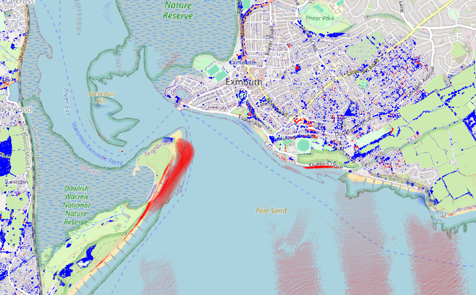
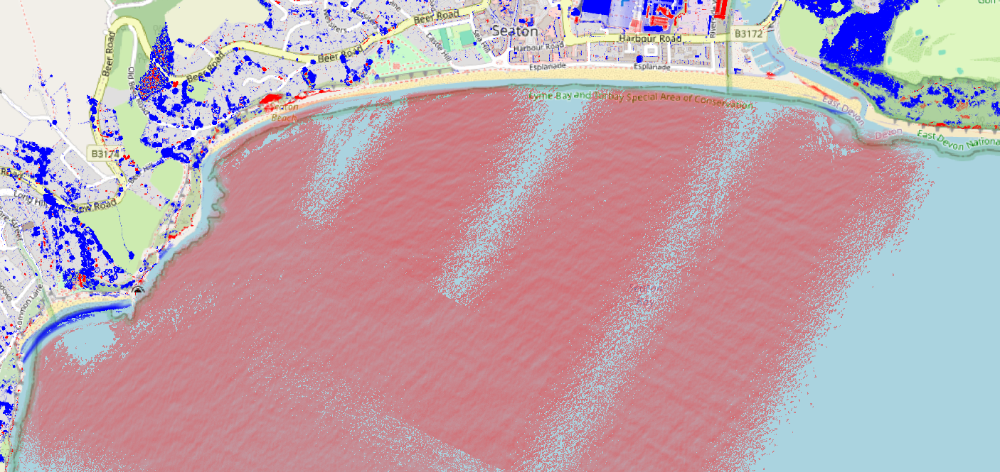

# QGIS Erosion Map

Tool to create coastal change heatmaps from point clouds

## Plugin Description:

This tool takes in an old point cloud, a new point cloud, and a visual reference map to create an overlaid heatmap that highlights areas where coastal deposits have been made in blue and highlights erosion in red.
This kind of analysis is especially useful for anticipating risks to infrastructure near coastlines.

(For Britain, use CRS: OSG36 / British National Grid.)

## Screenshots:

\
Erosion map of river delta in Exmouth showing changes between 2006 and 2020.

\
Erosion map of Seaton Bay showing changes between 2006 and 2020.

\
Erosion map of Port Isaac and surrounding area showing changes between 2007 and 2022.

\
Plugin UI
