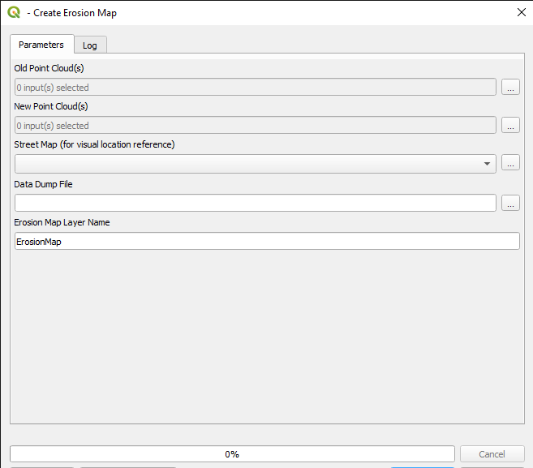

# QGIS Erosion Map

Tool to create coastal change heatmaps from point clouds

## Plugin Description:

This tool takes in an old point cloud, a new point cloud, and a visual reference map to create an overlaid heatmap that highlights areas where coastal deposits have been made in red and highlights erosion in blue.
This kind of analysis is especially useful for anticipating risks to infrastructure near coastlines.

(For Britain, use CRS: OSG36 / British National Grid.)

## Screenshot:

\
Erosion map of Port Isaac and surrounding area
\
\

\
Plugin UI
